# catalyst_count

This is a web application built python, Django Framework, PostgreSQL database, Bootstrap , HTML and CSS, authentication using Django allauth.

The application allows users to upload large volume CSV data with visual progress tracking, update the database with the file contents, and filter data using a form.

Features:-

File Upload
Users can log in to the application.
Users can upload a large volume CSV file (1GB) with a visual progress indicator.
Uploaded file contents are stored in the PostgreSQL database.

Data Filtering:-

Users can filter data using a form with specific criteria.
Filtered data is displayed with the count of records based on the applied filters.

Usage:-

Visit http://localhost:8000 in your web browser.
Register or log in to your account.
Upload a CSV file using the provided interface and monitor the progress.
Explore and filter the uploaded data using the filtering form.

Install the required Python packages
pip install -r requirements.txt

Steps involved for project setup:-
Step 1: created project catalyst_count
Terminal command:-
django-admin startproject catalyst_count

Step 2: Setting up Database for project 
catalyst_count/settings.py
updated the DATABASES configuration to use Postgres:

DATABASES = {
    ‘default’: {
        ‘ENGINE’: ‘django.db.backends.postgresql’,
        ‘NAME’: ‘catalyst_db’,
        ‘USER’: env(‘DB_USERNAME’),
        ‘PASSWORD’: env(‘DB_PASSWORD’),
        ‘HOST’: ‘localhost’,
        ‘PORT’: ‘5432’,
    }
}

Internal steps required for this:-
Created .env file under project directory to save the username and password 
.env file

Since .env file contains sensitive information, Saved it on .gitignore
Terminal command:-
cd catalyst_count
touch .gitignore

Once the .gitignore file was created, inside the file added a line:-
env

Step 3: Created new Repo on GitHub
git init
git remote add origin https://github.com/Sneham14/catalyst_count.git

Terminal command to save and commit the changes on .gitignore:-
git add .gitignore
git commit -m "Add .env to .gitignore”

Step 4: Configured Environment Variables using django-environ
Used environ.Env to read environment variables from a file. Environ will look for .env file which we have used to store sensitive data .

Updated catalyst_count/settings.py for environment variables configuration:

import environ
import os
env = environ.Env(DEBUG=(bool, False))
environ.Env.read_env(os.path.join(BASE_DIR, '.env'))
 
SECRET_KEY = env(‘SECRET_KEY’)
DEBUG = env(‘DEBUG’, default=False)

Updated the values for SECRET_KEY and DEBUG in .env file.

Step5: Configured Authentication using Django-allauth
Updated catalyst_count/settings.py for Django-allauth:

First step:- Registered allauth and allauth.account under installed apps 

INSTALLED_APPS = [
 ……    
     ‘django.contrib.sessions’,
     ‘django.contrib.messages’,
     ‘django.contrib.auth’,
    ‘django.contrib.sites’,
    ‘allauth’,
    ‘allauth.account’,
    ‘allauth.socialaccount’,
]

Second step:- This is responsible for handling authentication requests

AUTHENTICATION_BACKENDS = [
    ‘allauth.account.auth_backends.AuthenticationBackend’,
    ‘django.contrib.auth.backends.ModelBackend’,
]

Third step:-  To use django-allauth, included its URL configurations in project's urls.py
path('accounts/', include('allauth.urls'))

Step6:- Created catalyst_count_app inside the project directory
terminal command:
python3 manage.py startapp catalyst_count_app 

and rendered the app in settings.py 

Step7:- Once all forms, models and serialised created, ran command:-
python3 manage.py makemigrations
python3 manage.py migrate

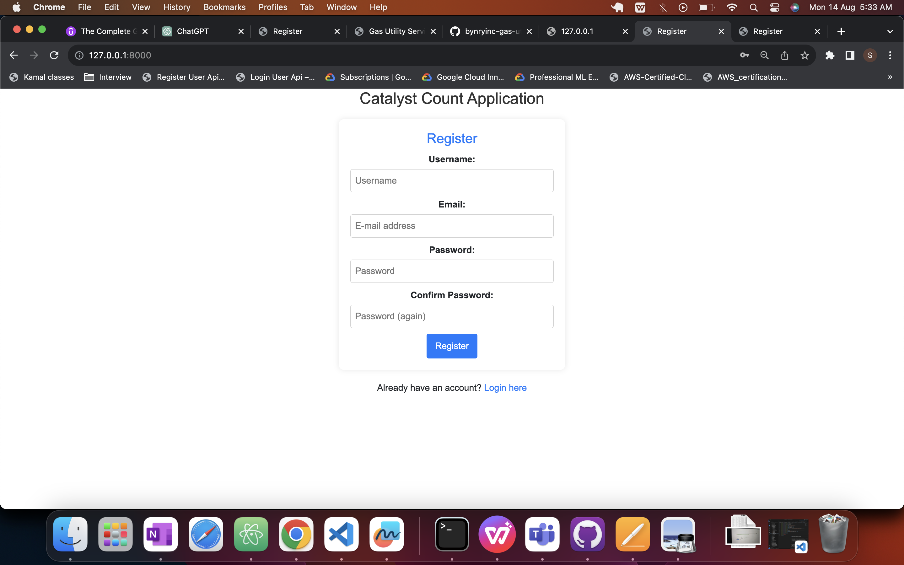
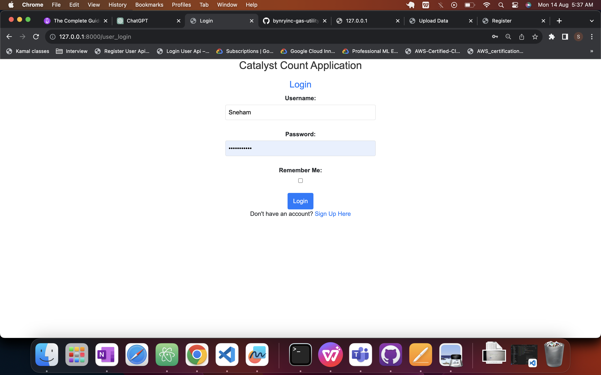
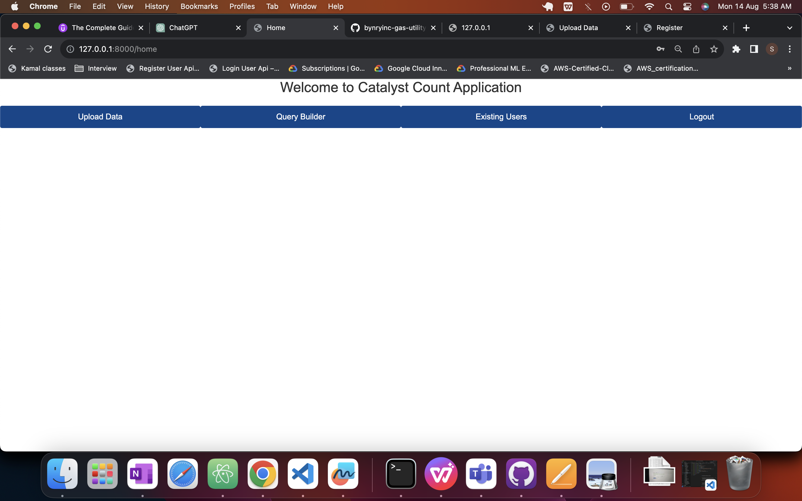
!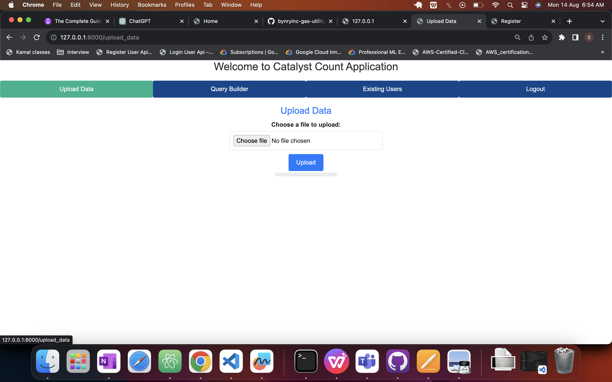
!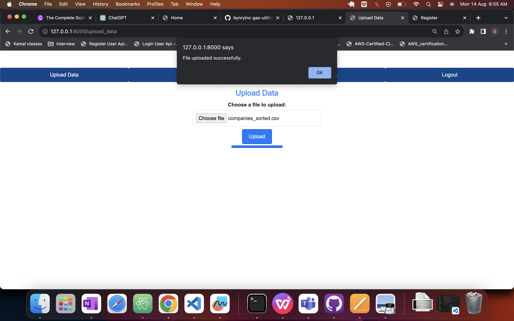
!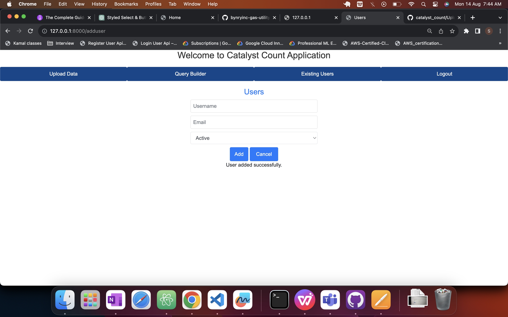
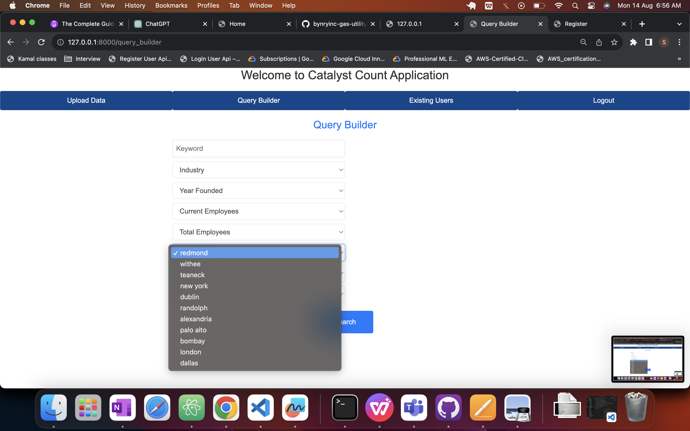

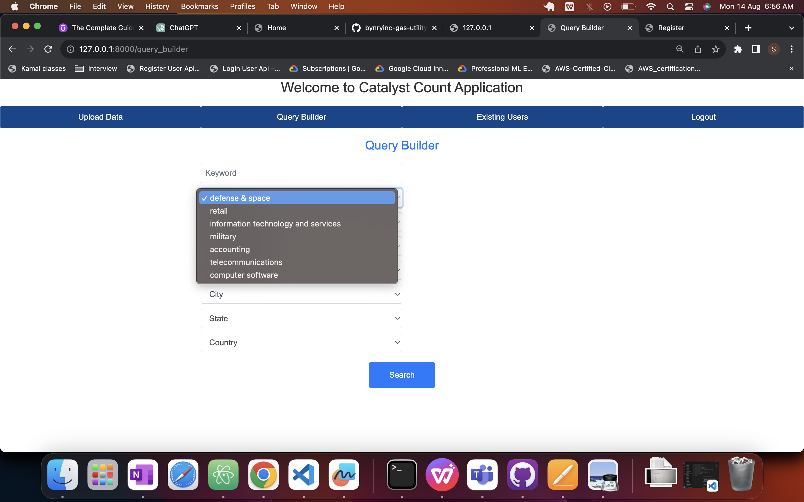
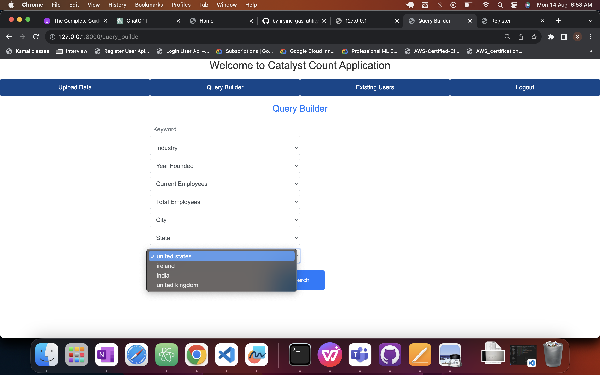
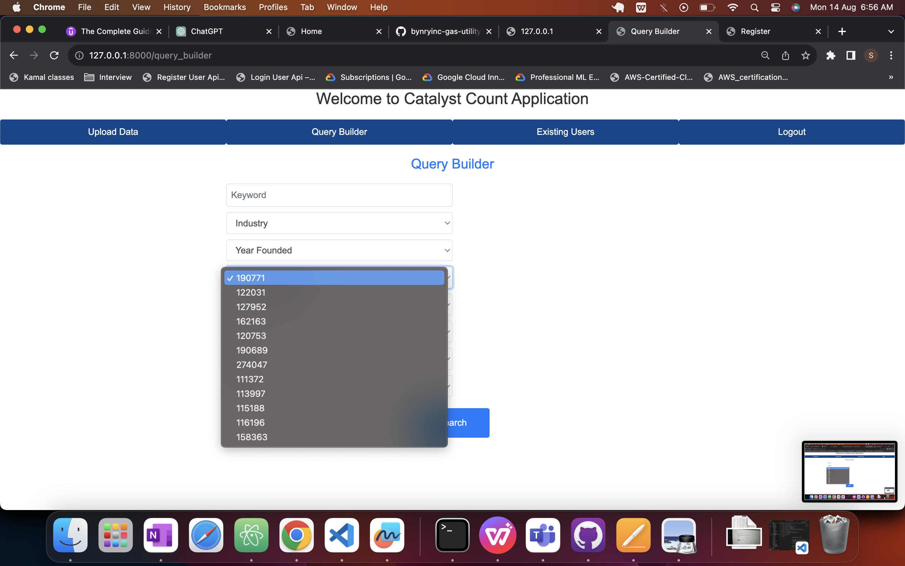
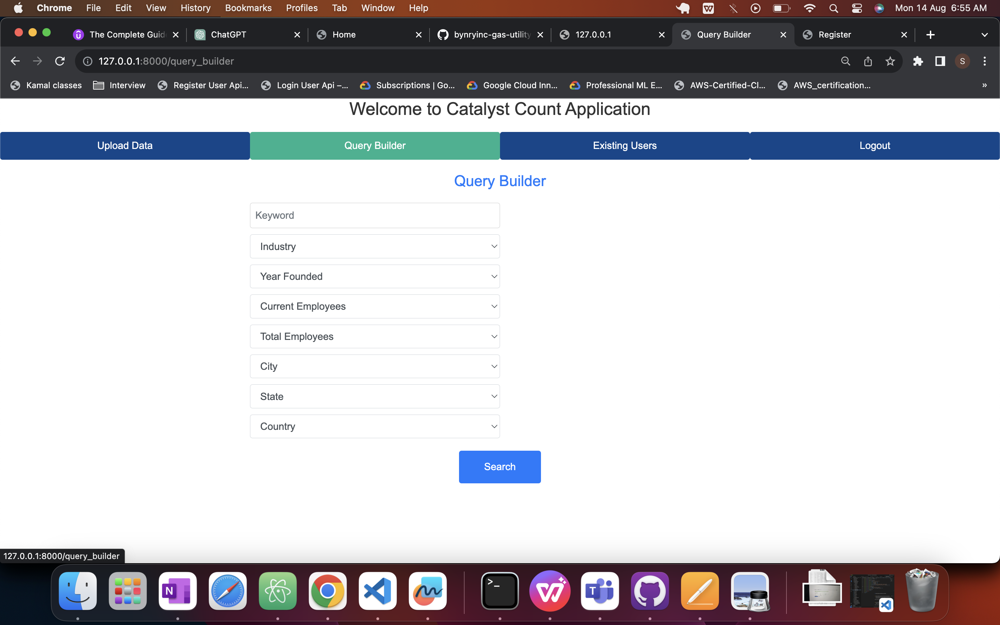
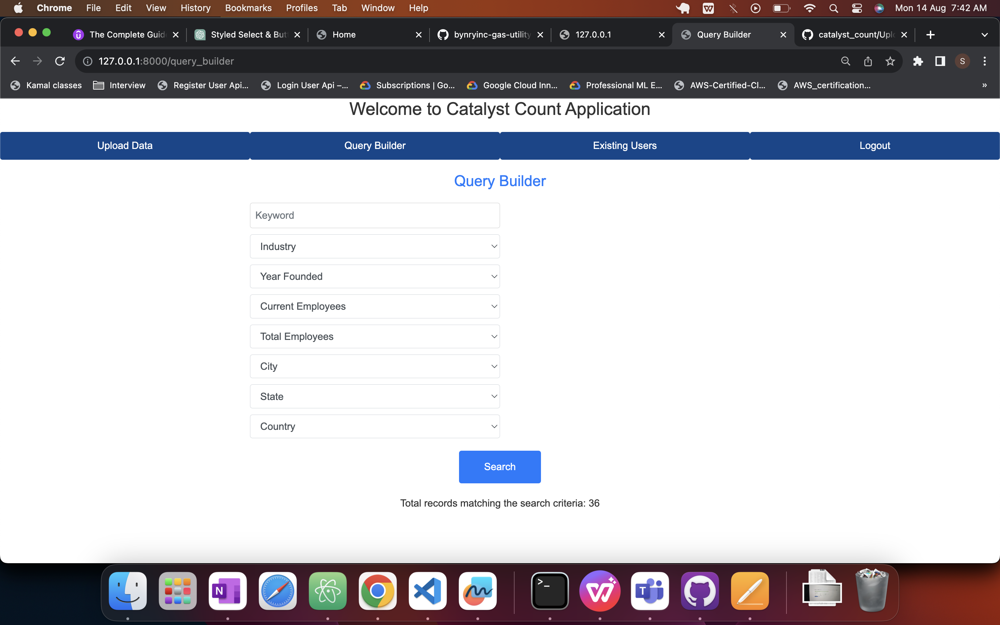
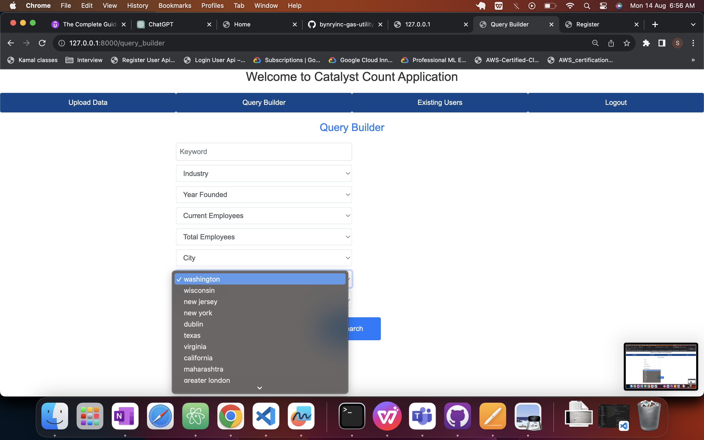
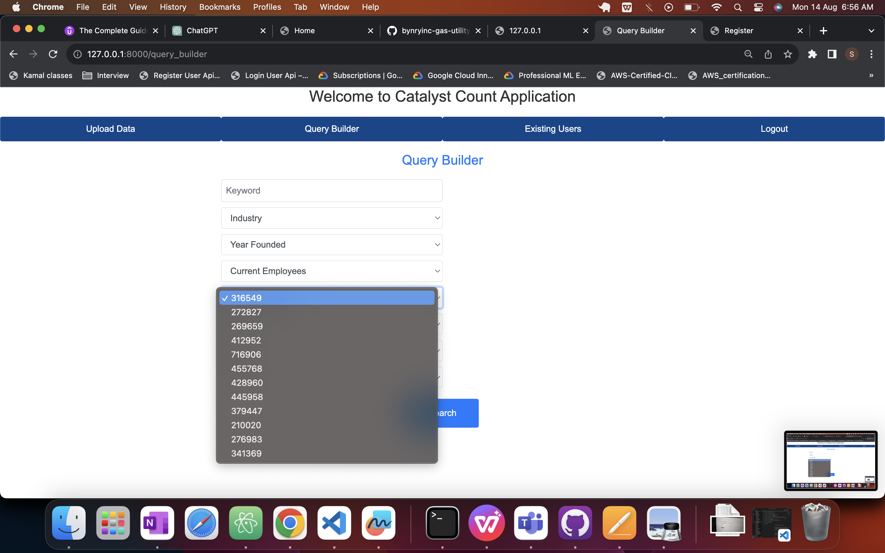
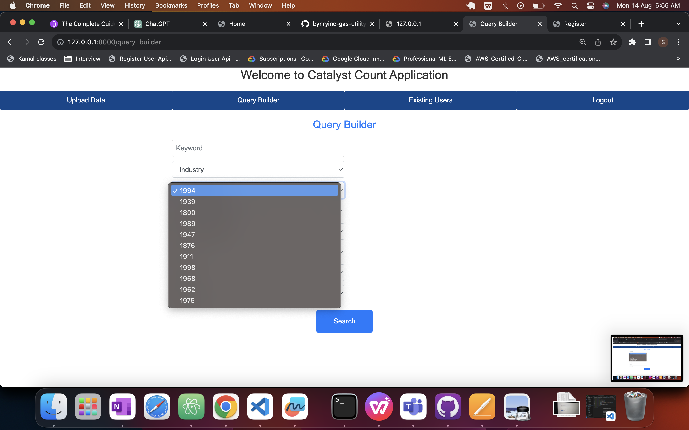
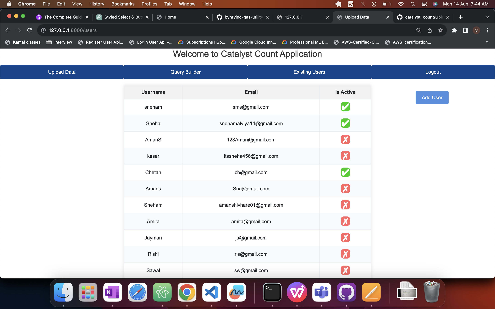

